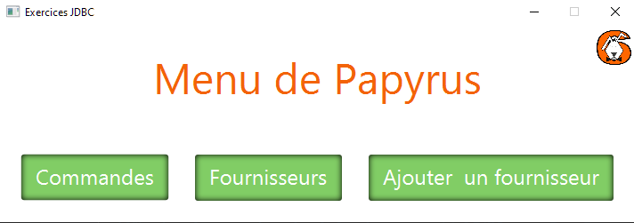
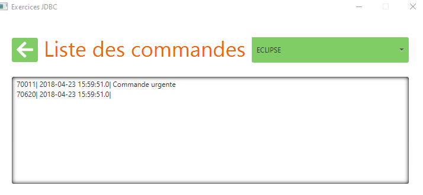
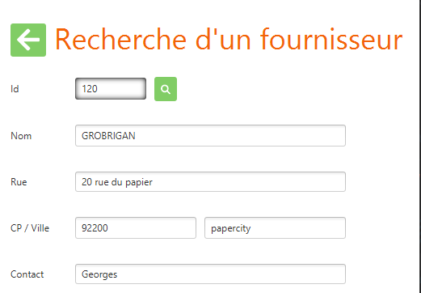
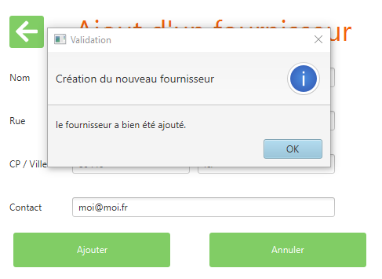

# jdbcExFournisseurs
correction exJDBC 1 2 3

Les 3 exercices sont ensembles dans la même appli.

- 1 menu de navigation (pas demandé)

- 2 les commandes par fournisseurs

- 3 recherche de fournisseur

- 4 ajout de fournisseur

- 5 confirmation d'enregistrement

> Attention, j'ai utilisé ikonli pour les icones et vous devez l'importer dans scenebuilder pour pouvoir ouvrir les fxml.

Je vais ajouter des branches pour les évolutions (factorisation, pattern DAO...)
